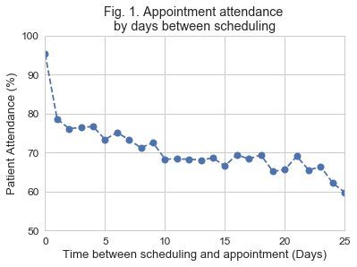

# Investigating Medical Appointment No Shows

### Summary
This project investigates possible factors behind whether or not patients miss their scheduled medical appointments. It was estimated in 2013 that missed appointments cost the U.S. health-care system more than $150 billion a year [(source)](http://www.post-gazette.com/business/businessnews/2013/02/24/No-shows-cost-health-care-system-billions/stories/201302240381). The source dataset for this study is comprised of 100k medical appointments in Brazil and includes various characteristics about the appointment such as the patient's preexisting conditions, gender, age, and welfare status.

The following factors are investigated with regards to appointment attendance rates:
* How long between scheduling and the actual appointment date?
* Does the patient have a medical scholarship (welfare)?
* What is the age of the patient?
* Are appointment text message reminders being sent to the patient?



## Getting Started

Cloning the git repository and installing the provided packages will help you get a copy of the project up and running on your local machine. The program was written with Python and the packages were managed using the Ananconda platform. 

```
git clone https://github.com/daniel-codes/medical-no-shows
pip install -r /path/to/requirements.txt
```

File Description:
* investigate-a-dataset-template.ipynb - Jupyter Notebook for this project including exploratory data analysis and price prediction
* noshowappointments-kagglev2-may-2016.csv - Copy of source data

## Authors

- **Daniel Cummings** - [daniel-codes](https://github.com/daniel-codes)

## Acknowledgments
   
I found these resources particularly helpful for this project:   
https://stackoverflow.com/questions/33381330/histogram-with-boxplot-above-in-python    
https://seaborn.pydata.org/tutorial/aesthetics.html    
https://pandas.pydata.org/pandas-docs/stable/api.html    